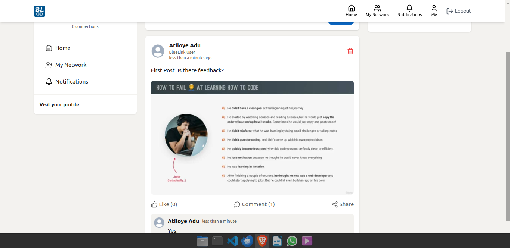

**BlueLink Social App**
================
##### (a linkedin clone)
----

**Description**
---------------

 This is a site made with inspiration from the Linkedin platform. It has a fully functional frontend and backend service courtesy of React, Vite, tailwind css, Daisy Ui, MongoDB, Mailtrap and Cloudinary.

**Screenshots**
-----------------

### Links

* [GitHub Repo](https://github.com/Atiloye/bluelink-app/)
* [Live Link](https://bluelink-app.onrender.com/)

**License**
-------

This project is licensed under the [MIT License](https://opensource.org/licenses/MIT).
